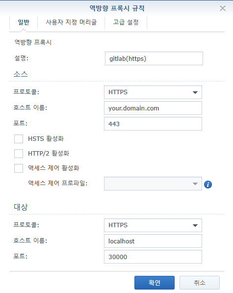

# Why use reverse proxy?
If you use Reverse proxy, you do not need to enter a port.

# 1. Container environment variables setting
1. Run docker package
2. `Container` tab click
3. select `synology_gitlab` and edit click
4. `Environment` tab click
5. Edit environment variables
```
GITLAB_PORT=443
```

# 2. Reverse proxy settings
1. Open control panel.
2. Application Portal click
3. Reverse Proxy tab click
4. `Create` button click
5. edit  

6. OK

# Done.